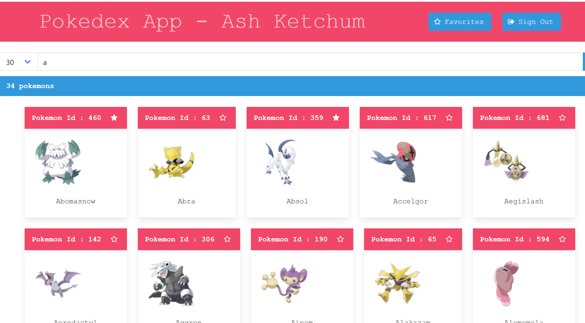
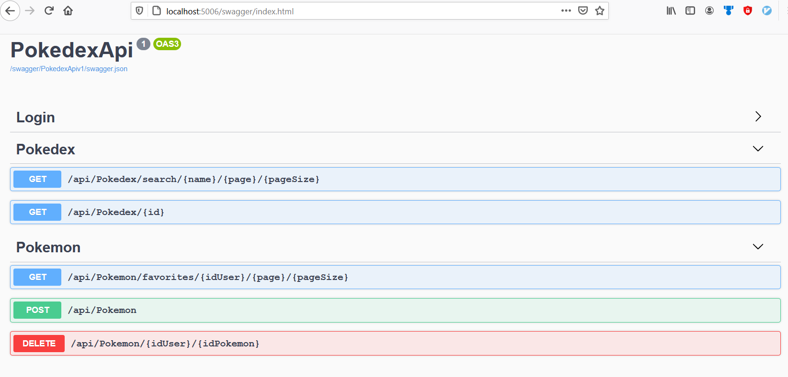
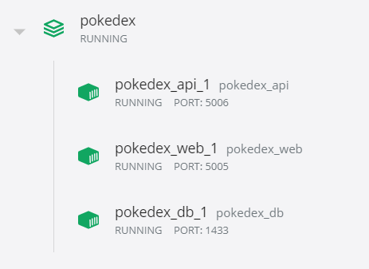

# Pokedex App

Sample pokedex app, that allow you to look for pokemons an save them as favorites.  
Data from https://github.com/fanzeyi/pokemon.json

## Steps:

1. git clone repo
2. docker-compose up

### Ports
 - Web: localhost:5005 (Frontend - Angular App)
 - Api: localhost:5006 (Backend - ASP.NET Core)
 - Db : localhost:1433 (Database - SQL server for Linux)

## User sample

 username : Ash  
 password: 123456

## Requeriments

- Docker

## Captures

